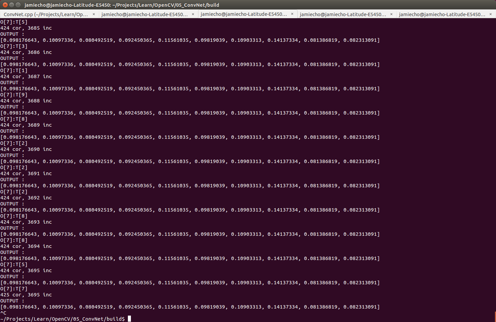
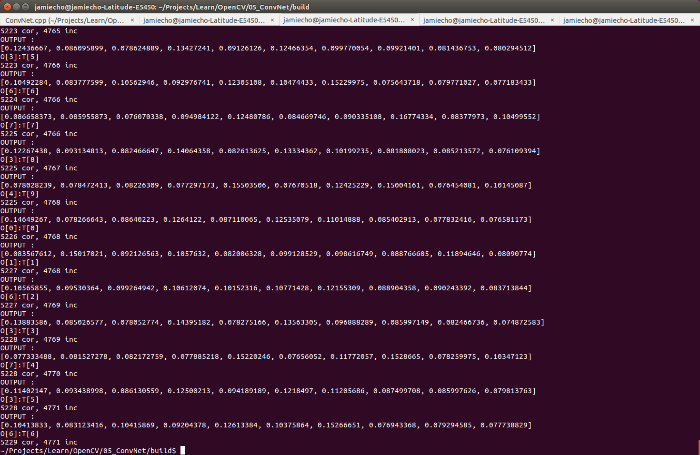

Convolution Neural Network

- [x] Implemented Convolutional Layer
- [x] Implemented Pooling Layer
- [x] Implemented Activation Layer 
- [x] Implement Neural Network
- [ ] Optimization Schemes other than stochastic gradient descent

Debugging
- [x] Tested Until al2 Layer --> Now Working
- [x] Tested Conv Layer --> Reasonably Working

To Do:
- [ ] Modularize Code: too much in one file
- [x] Test With Learning, not just running
- [x] Logistic Regression / SoftMax Layer
- [ ] Solve the "Dead Relu" problem : alternatives??

Dead Relu

Alive Relu

