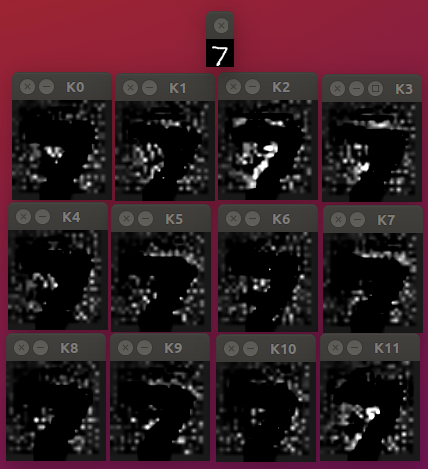
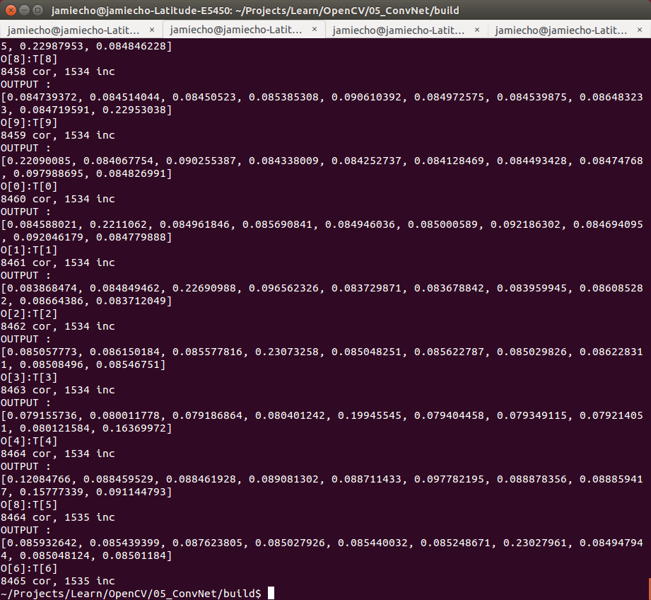

Convolution Neural Network

- [x] Implemented Convolutional Layer
- [x] Implemented Pooling Layer
- [x] Implemented Activation Layer 
- [x] Implement Neural Network
- [ ] Implement Optimization Schemes other than stochastic gradient descent
- [ ] Vectorize Layers(Convolution Depths) from std::vector

Debugging
- [x] Tested Until al2 Layer --> Now Working
- [x] Tested Conv Layer --> Reasonably Working

To Do:
- [x] Modularize Code: too much in one file
- [x] Test With Learning, not just running
- [x] Logistic Regression / SoftMax Layer
- [x] Solve the "Dead Relu" problem --> solved by initializing to mostly positive weights
- [x] Handle SIGINT to quit midway gracefully
- [ ] Add Saving/Loading of Networks
- [ ] Turn Hard-coded parameters into tunable parameters

Dead Relu

Alive Relu

---
Training Sample With MNIST Data:

Identified Kernels:

Classification Results:

